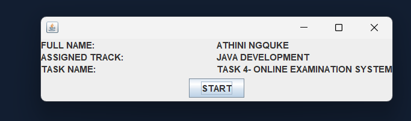
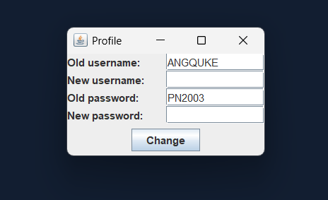
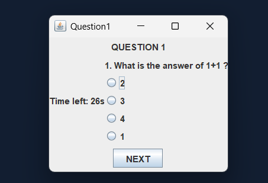
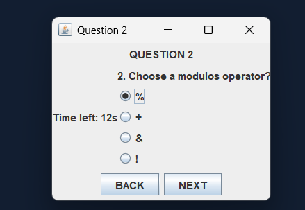
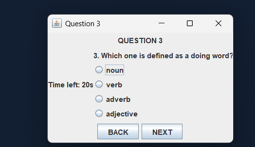
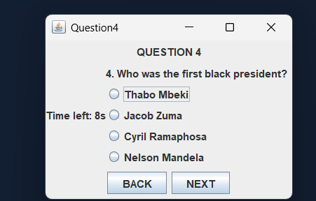
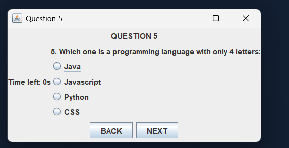
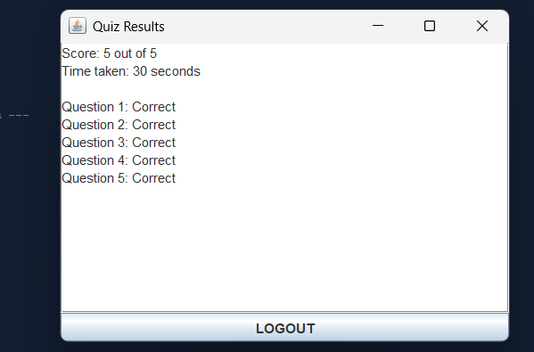
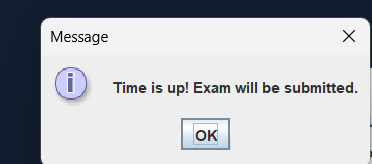

### *TASK 4 · Online Examination System*

*Objective:* Build a GUI-based examination system where students log in, answer multiple-choice questions within a timer, and are auto-submitted when time runs out.

*Tech Stack:* Java, Swing (GUI)

*Feature Checklist:*
- *Login screen:* username + password; on success, load the exam interface
- *Profile update screen:* allow the user to change their display name and password before starting
- *Exam screen:* displays one MCQ at a time with 4 radio button options
- *Navigation:* Next and Previous buttons to move between questions
- *Countdown timer* visible at all times (e.g., 30 minutes); auto-submits the exam when it reaches zero
- *Manual submit button* with a confirmation dialog
- *Result screen:* displays score (X out of Y), time taken, and a breakdown of correct/incorrect answers
- *Session management:* clicking the window's close button during an exam triggers a "Are you sure you want to quit?" dialog
- *Logout button* on the result screen that returns to the login screen

### *GUI Screenshots*
Add screenshots of your application screens here
###  *Title Card* ###
   
   
### *Login Screen* ### 
   

### *Profile Update Screen* ### 
   

### *Exam Screen 1 with Timer* ### 
   
   
### *Exam Screen 2 with Timer* ###
  

### *Exam Screen 3 with Timer* ###
  

### *Exam Screen 4 with Timer* ###
  

### *Exam Screen 5 with Timer* ###
  
  
### *Result Screen* ###

### *Time up screen* ###
  
  

### *YouTube Demo Link* ###

Below is the walkthrough of my projecthere

[Watch Demo on YouTube]([https://youtu.be/lze3XWJf7rM](https://youtu.be/iSlx4JrcJP4?si=ruK1JBfTl8HUuX6V))
