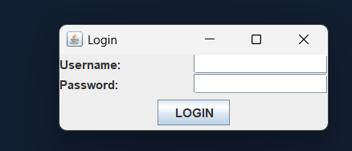
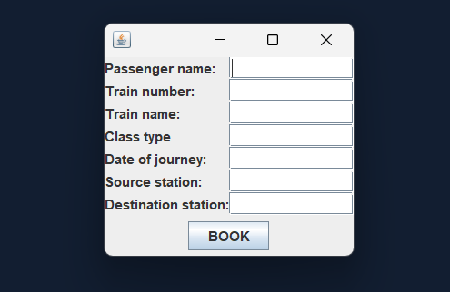
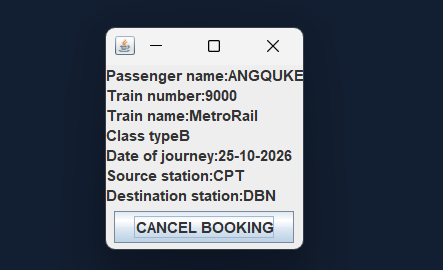
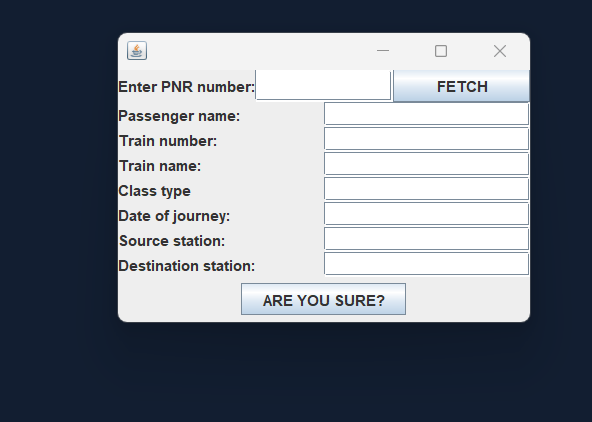

### *TASK 1 · Online Reservation System* ###

*Objective:* Build a GUI-based train reservation system where users can log in, book tickets, and cancel bookings using a PNR number.

*Tech Stack:* Java (Swing for GUI), JDBC.

---

### *Feature Checklist:*
- *Login Form:* username + password fields; access denied for invalid credentials
- *Reservation Form:* fields for passenger name, train number, train name (auto-populated from train number), class type, date of journey, source station, destination station
- *Insert/Book button* that saves the reservation to the database and generates a *PNR number* (auto-generated unique ID)
- *Confirmation dialog* showing booking details after successful reservation
- *Cancellation Form:* PNR number input field + Fetch button that retrieves and displays the full booking details
- *Confirm cancellation button* with an "Are you sure?" dialog; removes the booking from the database on confirmation
- *Basic input validation:* no empty required fields, valid date format, numeric train number

### *GUI Screenshots*
Below are the screenshots of my application interfaces screens here

### *Title Card* ###

### *Login Form* ###

### *Reservation Form* ###

### *Confirmation Screen* ###

### *Cancellation Form* ###

